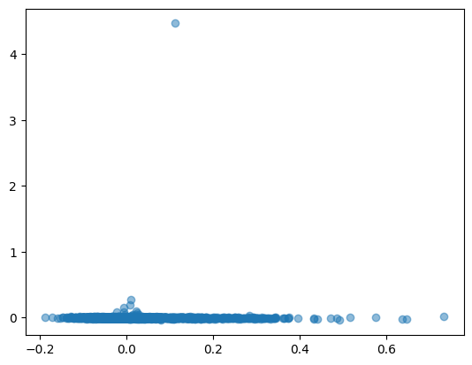
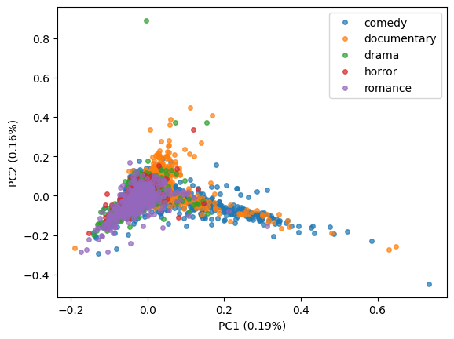

Principle Component Analysis (PCA) Example
------------------------------------------

Importing Necessary Packages

.. code-block :: python

	import butext as bax
	from sklearn.decomposition import PCA
	import pandas as pd
	from sklearn.feature_extraction.text import ENGLISH_STOP_WORDS
	import matplotlib.pyplot as plt

Uploading Dataset

.. code-block :: python

	

** **

.. code-block :: python

	def tokPCA(df, txtcolname, title, dim, preserves):
    '''
    df: The DataFrame being tokenized and projected into the PCA

    txtcolname: The column of df that contains strings of texts to be tokenized

    title: The column that contains the titles of this text

    dim: The number of dimensions demanded for the PCA

    preserves: A list of other column names that the user would like re-added to the PCA dataframe.

    '''
    reservedf = df[[title] + preserves]

	
**Output**

** **

.. code-block :: python

	tokens = (
   	df
    .pipe(bax.tokenize, txtcolname)
    ) #Gets tokenized version of dataframe using the butext tokenization
    df_tok = tokens.loc[ ~tokens["word"].isin(ENGLISH_STOP_WORDS) ] #Removes stop-words from the 	tokenized dataframe

	

**Output**

.. code-block :: none

** **

.. code-block :: python

	
    tfidf = (
    df_tok
    .groupby(title)['word'].value_counts(normalize = True)
    .reset_index()
    .pipe(bax.tf_idf, title)
    ) #Gets TF-IDF values from tokenized dataframe
    X = tfidf.pivot(index=title, columns="word",values="tf_idf").fillna(0)
    #pivots the data and fills NaNs as to make the format correct for scikit-learn's PCA function

**Output**

.. code-block :: python

	 pca = PCA(n_components=dim)
    X_r = pca.fit(X).transform(X) #"reduced" X
    pca_df = pd.DataFrame(X_r, columns=['PC1', 'PC2'], index=X.index)
    pca_df.reset_index(inplace=True)
    pca_df = pd.merge(reservedf, pca_df, on=title)
    return(pca_df)

.. code-block :: python

	ntflx = pd.read_csv("https://raw.githubusercontent.com/Greg-Hallenbeck/class-datasets/main/datasets/netflix.csv")
	ntflx["genre"] = ""
	ntflx.loc[ntflx["genres"].str.contains("drama"), "genre"] = "drama"
	ntflx.loc[ntflx["genres"].str.contains("comedy"),"genre"] = "comedy"
	ntflx.loc[ntflx["genres"].str.contains("horror"),"genre"] = "horror"
	ntflx.loc[ntflx["genres"].str.contains("romance"),"genre"] = "romance"
	ntflx.loc[ntflx["genres"].str.contains("documentation"),"genre"] = "documentary"
	ntflx = ntflx.loc[ntflx["genre"] != ""]
	ntflx

**Output**

.. code-block :: none

	id	title	type	description	release_year	age_certification	runtime	genres production_countries	seasons	imdb_id	imdb_score	imdb_votes	tmdb_popularity	tmdb_score	genre
	0	ts300399	Five Came Back: The Reference Films	SHOW	This collection includes 12 World War II-era p...	1945	TV-MA	48	['documentation']	['US']	1.0	NaN	NaN	NaN	0.600	NaN	documentary
	1	tm84618	Taxi Driver	MOVIE	A mentally unstable Vietnam War veteran works ...	1976	R	113	['crime', 'drama']	['US']	NaN	tt0075314	8.3	795222.0	27.612	8.2	drama
	2	tm127384	Monty Python and the Holy Grail	MOVIE	King Arthur, accompanied by his squire, recrui...	1975	PG	91	['comedy', 'fantasy']	['GB']	NaN	tt0071853	8.2	530877.0	18.216	7.8	comedy
	3	tm70993	Life of Brian	MOVIE	Brian Cohen is an average young Jewish man, bu...	1979	R	94	['comedy']	['GB']	NaN	tt0079470	8.0	392419.0	17.505	7.8	comedy
	4	tm190788	The Exorcist	MOVIE	12-year-old Regan MacNeil begins to adapt an e...	1973	R	133	['horror']	['US']	NaN	tt0070047	8.1	391942.0	95.337	7.7	horror
	...	...	...	...	...	...	...	...	...	...	...	...	...	...	...	...	...
	5782	tm1040816	Momshies! Your Soul is Mine	MOVIE	Three women with totally different lives accid...	2021	NaN	108	['comedy']	['PH']	NaN	tt14412240	5.8	26.0	4.112	NaN	comedy
	5783	tm1014599	Fine Wine	MOVIE	A beautiful love story that can happen between...	2021	NaN	100	['romance', 'drama']	['NG']	NaN	tt13857480	6.9	39.0	0.966	NaN	romance
	5784	tm1108171	Edis Starlight	MOVIE	Rising star Edis's career journey with ups and...	2021	NaN	74	['music', 'documentation']	[]	NaN	NaN	NaN	NaN	1.036	8.5	documentary
	5785	tm1045018	Clash	MOVIE	A man from Nigeria returns to his family in Ca...	2021	NaN	88	['family', 'drama']	['NG', 'CA']	NaN	tt14620732	6.5	32.0	0.709	NaN	drama
	5787	ts271048	Mighty Little Bheem: Kite Festival	SHOW	With winter behind them, Bheem and his townspe...	2021	NaN	0	['family', 'comedy', 'animation']	[]

.. code-block :: python

	newdf = tokPCA(ntflx,"description","id",2,["genre","age_certification"])
	newdf

**Output**

.. code-block :: none

	id	genre	age_certification	PC1	PC2
		0	ts300399	documentary	TV-MA	0.029556	0.000573
		1	tm84618	drama	R	-0.004263	0.004507
		2	tm127384	comedy	PG	-0.003020	0.000247
		3	tm70993	comedy	R	-0.014535	-0.001630
		4	tm190788	horror	R	-0.039231	0.000530
		...	...	...	...	...	...
		5074	tm1040816	comedy	NaN	-0.009749	0.001129
		5075	tm1014599	romance	NaN	-0.073217	-0.018134
		5076	tm1108171	documentary	NaN	0.032761	-0.021259
		5077	tm1045018	drama	NaN	-0.049431	-0.000664
		5078	ts271048	comedy	NaN	0.023012	0.000648

Problem: Visualizing this PCA makes it clear that an outlier is skewing the data. Because PCA finds the dimensions meant to explain a lot of variance in the data, outliers can skew the dimensions and make them less useful for visualization.

.. code-block :: python

	plt.scatter(x=newdf.PC1,y=newdf.PC2,alpha=0.5)

.. code-block :: python

	outlier = newdf[newdf.PC2>1]
	outlier #the value we want to get rid of

**Output**

.. code-block :: none

		id		genre	    age_certification	PC1		PC2
	2299	tm375302	documentary	NaN		0.110894	4.468589

Now that we know what value is causing the discrepancy, we can re-run the function.

.. code-block :: python

	ntflx2 = ntflx[ntflx.id != "tm375302"]
	newdf2 = tokPCA(ntflx2,"description","id",2,["genre","age_certification"])
	#https://www.statology.org/matplotlib-scatterplot-color-by-value/
	groups = newdf2.groupby("genre")
	for name, group in groups:
	plt.plot(group.PC1, group.PC2, marker='o', linestyle='', markersize=4,alpha=0.7,label=name)
	plt.xlabel("PC1 (0.19%)")
	plt.ylabel("PC2 (0.16%)")
	plt.legend()
	plt.show()

**Output**

Judging by the PCA, certain patterns begin to emerge which can tell us about what our principal components may represent. PC1 may have to do with the "seriousness" of words, while PC2 may have to do with whether words are more emotional or descriptive.

