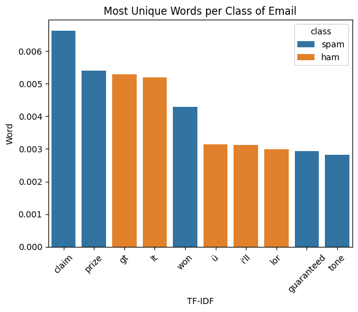

**Term-Frequency Inverse Document Frequency (TF-IDF)**
------------------------------------------------------

TF-IDF stands for text-frequency inverse document-frequency and it used to study mutliple texts. This improves on relative frequency as it can only work on two. TF-IDF is defined as:

𝑇𝐹⋅𝐼𝐷𝐹=𝑇𝐹ln(1𝐷𝐹)=−𝑇𝐹ln(𝐷𝐹) 

Where TF is text frequency:
𝑇𝐹=text frequency=# of times 𝑤𝑜𝑟𝑑 appears in a documenttotal words in the document 
and DF is document frequency:
𝐷𝐹=document frequency=# of documents 𝑤𝑜𝑟𝑑 appears in# of documents 

This improves upon basic word counting and relative frequecies as it measures the uniquness of a word to a given document, while relative frequency and word counting does not. The logarithm is good because  𝑙𝑜𝑔(1)=0 , so any word that appears in every document will have a TF-IDF of zero and is not unique. This process helps naturally remove stopwords, however, it might be still practice to remove them manually.

TF-IDF can also be used to help create machine learning models like Support Vector Machines and Logistic Regressions as it turns words is specific numerical values (or vectors). This will explored later.

Now that our data is loaded, we can use our TF-IDF function to find the most unique word to each class, which is spam or ham. We will use bax.tf_idf and is best used with pipe() operator. We will also utilize our stopewords function denoted by bax.stopwords as it removes words not important to our analysis. However, this is not super important for TF-IDF as it drives many stopwords to a zero value naturally.

.. code-block :: python

	spam_tfidf = (
    		spam
    		.pipe(bax.tokenize, 'text') # tokenizes text
    		.pipe(bax.stopwords, 'word') # removes stopwords
    		.groupby('class')['word']
    		.value_counts(normalize=True) # text frequency
    		.reset_index()
    		.pipe(bax.tf_idf, col='class') # tf-idf calculation
	)
	x = spam_tfidf.sort_values(by = 'tf_idf', ascending= False)
	x = x.loc[x.tf_idf != 0] # many words will have tf_idf = 0 but those words aren't 		important, so we can filter them out for cleaner results
	x

.. code-block :: python
	
	graph = x[0:10]
	sns.barplot(graph, x = "word", y = 'tf_idf', hue = "class" , legend= True)
	plt.title('Most Unique Words per Class of Email')
	plt.xlabel('TF-IDF')
	plt.ylabel('Word')
	plt.xticks(rotation = 45)
	plt.show()

**Output** 

Here we can see which words are the most unique to the spam and ham classes. Now we can finally see which words are truy most associated with each class of email. There is some of the same words from relative frequencies and word counting and there is some new ones. Which one you choose depends on the context of the situation. In situations where there are more than two documents, you need to use TF-IDF instead of relative frequencies. When there is only two documents, relative frequencies is still a great method, and it is a bit more interpretable as well. In the case of Machine Learning, TF-IDF is definitely the better measure to proceed with. Overall, they are both great methods for textual anlysis depending on the context, and most importantly is all possible due to tokenization.

