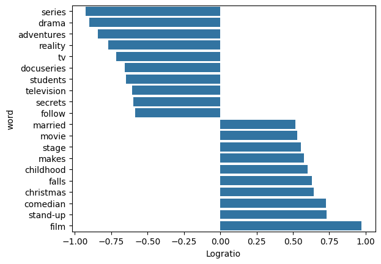
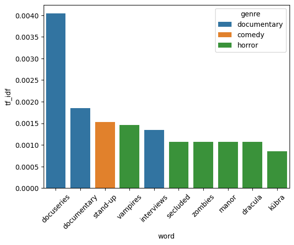

Basic Usage 
-------------------

Importing Necessary Packages

.. code-block :: python

	import pandas as pd
	import matplotlib.pyplot as plt
	import seaborn as sns
	from sklearn.feature_extraction.text import ENGLISH_STOP_WORDS
	import butext as bax

Uploading Dataset

.. code-block :: python

	netflix = pd.read_csv("https://tinyurl.com/27kzukwk")
	netflix[['type', 'description']].head(2)

**Output**

.. code-block :: none 

		type	description
	0	SHOW	This collection includes 12 World War II-era p...
	1	MOVIE	A mentally unstable Vietnam War veteran works ...
	2	MOVIE	King Arthur, accompanied by his squire, recrui...
	3	MOVIE	Brian Cohen is an average young Jewish man, bu...
	4	MOVIE	12-year-old Regan MacNeil begins to adapt an e...

*Data Tokenization*

.. code-block :: python

	tokens = (
	netflix
	.pipe(bax.tokenize, 'description')
	)

.. code-block :: python

	tokens['word'].value_counts()

**Output**

.. code-block :: none

	word    count
	the	11709
	a	 9312
	and	 7475
	to	 6841
	of	 6310
	...	 ...
	curated	   1
	pieced	   1
	they'd	   1
	visualize  1
	iran	   1

*Relative Frequency*

.. code-block :: python

	df = tokens[['word', 'type']]
	df = df.loc[ ~df["word"].isin(ENGLISH_STOP_WORDS) ]

	rel_freq = (
    	df
    	.groupby('type')['word'].value_counts(normalize = True)
    	.reset_index()
    	.query('proportion > 0.0005')
    	.pipe(bax.rel_freq, 'type')
	)

.. code-block :: python

	rel_freq = rel_freq.sort_values(by = 'logratio', ascending= True)
	rel_freq

**Output**

.. code-block :: none

	type	word	MOVIE		SHOW		rel_freq	logratio
	245	series	0.000883	0.007439	0.118762	-0.925322
	71	drama	0.000250	0.001998	0.125120	-0.902672
	3	adven..	0.000250	0.001733	0.144236	-0.840926
	225	reality	0.000250	0.001468	0.170246	-0.768923
	297	tv	0.000250	0.001300	0.192315	-0.715987
	...	...	...		...		...		...
	89	falls	0.001067	0.000250	4.269886	0.630416
	33	chris..	0.001104	0.000250	4.417124	0.645140
	37	comed..	0.001337	0.000250	5.349628	0.728324
	264	stand..	0.001350	0.000250	5.398707	0.732290
	98	film	0.002344	0.000250	9.374118	0.971930

.. code-block :: python

	mostfreq = pd.concat([  rel_freq[0:10] , rel_freq[-10:]  ])
	sns.barplot(data=mostfreq, x="logratio", y="word")
	plt.xlabel("Logratio")
	plt.show()

**Output**

Our function compares the frequency of  words in movie descriptions to its frequency in a show descriptions. By taking the logarithm of this ratio, we can evaluate how strongly each word is associated with either category. Because log(A / B) = log(A) − log(B), a negative value indicates that the word is more strongly associated with shows, while a positive value indicates a stronger association with movies.

*TF-IDF*

.. code-block :: python
	
	netflix["genre"] = ""
	netflix.loc[netflix["genres"].str.contains("drama"), "genre"] = "drama"
	netflix.loc[netflix["genres"].str.contains("comedy"),"genre"] = "comedy"
	netflix.loc[netflix["genres"].str.contains("horror"),"genre"] = "horror"
	netflix.loc[netflix["genres"].str.contains("romance"),"genre"] = "romance"
	netflix.loc[netflix["genres"].str.contains("documentation"),"genre"] = "documentary"
	netflix = netflix.loc[netflix["genre"] != ""]

.. code-block :: python

	tokens2 = (
    netflix
    .pipe(bax.tokenize, 'description')
	)

.. code-block :: python

	df = tokens2[['genre', 'word']]
	df = df.loc[ ~df["word"].isin(ENGLISH_STOP_WORDS) ]

	tfidf = (
    	df
    	.groupby('genre')['word'].value_counts(normalize = True)
    	.reset_index()
    	.pipe(bax.tf_idf, 'genre')
	)

.. code-block :: python

	x = tfidf.loc[tfidf.tf_idf != 0]
	x = x.sort_values(by = 'tf_idf', ascending= False)
	x

**Output**

.. code-block :: none

		genre	word		tf		idf		tf_idf
	10623	docu...	docuseries	0.002510	1.609438	0.004039
	10611	docu...	documentary	0.008293	0.223144	0.001851
	9	comedy	stand-up	0.003001	0.510826	0.001533
	27777	horror	vampires	0.001597	0.916291	0.001463
	10649	docu...	interviews	0.001473	0.916291	0.001350
	...	...	...		...		...		...
	5235	comedy	celebratory	0.000032	0.223144	0.000007	
	5275	comedy	charged		0.000032	0.223144	0.000007
	5204	comedy	carries		0.000032	0.223144	0.000007
	10098	comedy	treacherous	0.000032	0.223144	0.000007
	10071	comedy	trafficking	0.000032	0.223144	0.000007

.. code-block :: python

	viz = x[0:10]
	sns.barplot(data = viz, x= 'word', y = 'tf_idf', hue = 'genre')
	plt.xticks(rotation = 45)
	plt.show()

**Output**

