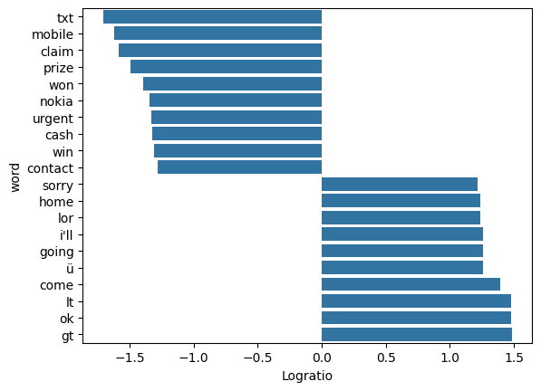

**Relative Frequency**
----------------------

While the processes of counting words in tokenization is useful, it sometimes can be hard to interpret. This is mainly due to documents containg hundred of thousands or even millions of tokens. So, in general, words tend to appear more, thus making their appeareance less meaningful. So we can then naturally go to use their text frequncy which can be defined as:

𝑇𝐹  = text frequency =  # of times 𝑤𝑜𝑟𝑑 appears in a document/total words in the document 

Furthermore, we can go on to define their relative frequencies which can be defined as:

						𝑅𝐹=relative frequency=𝑇𝐹 document 1/𝑇𝐹 document 2 

This now allows us to find which words are more frequnetly associated with each document.

Another addition to relative frequencies that assists in intepretation is the logratio. The logration is simply defined as:
𝑙𝑜𝑔(𝑇𝐹 document 1𝑇𝐹 document 2) 

This is important because if a word has a higher frequnecy in document 1, the logratio will be more positive, and thus more greatly associated with document 1. This is because  𝑙𝑜𝑔(𝐴𝐵)  = 𝑙𝑜𝑔(𝐴)−𝑙𝑜𝑔(𝐵) 

**Importing Necessary Packages**

.. code-block :: python

	import butext as bax
	import pandas as pd
	import matplotlib.pyplot as plt
	import seaborn as sns

**Load Data** 

.. code-block :: python
	
	spam = pd.read_csv("https://tinyurl.com/4narz8b3", sep="\t")
	spam.head(5)

**Relative Frequency In Action**

.. code-block :: python

	rel_freq = (
    		spam
    		.pipe(bax.tokenize, 'text') #tokenize text
    		.pipe(bax.stopwords, 'word') # removes stopwords
    		.groupby('class')['word'].value_counts(normalize = True) # calculates text frequencies per class
    		.reset_index()
    		.query('proportion > 0.0005') # removes meaningless words
    		.pipe(bax.rel_freq, 'class') # calculates relative frequency
	)

.. code-block :: python
	
	rel_freq = rel_freq.sort_values(by = 'logratio', ascending= True)
	rel_freq

**Output**

.. code-block :: none 

	class	word	ham		spam		rel_freq	logratio
	597	txt	0.000250	0.012698	0.019688	-1.705791
	391	mobile	0.000250	0.010412	0.024010	-1.619605
	145	claim	0.000250	0.009566	0.026135	-1.582778
	462	prize	0.000250	0.007788	0.032101	-1.493488
	653	won	0.000250	0.006180	0.040455	-1.393023
	...	...	...	...	...	...
	681	ü	0.004536	0.000250	18.142780	1.258704
	152	come	0.006173	0.000250	24.691358	1.392545
	358	lt	0.007488	0.000250	29.951691	1.476421
	423	ok	0.007488	0.000250	29.951691	1.476421
	266	gt	0.007622	0.000250	30.488459	1.484135

.. code-block :: python

	mostfreq = pd.concat([  rel_freq[0:10] , rel_freq[-10:]  ])
	sns.barplot(data=mostfreq, x="logratio", y="word")
	plt.xlabel("Logratio")
	plt.show() 

**Output**

This graph visualize the top 10 words most associated with spam and ham emails, with spam being positive and ham being negative. We can see we get some of the same words from the general word counting, but also get some new ones. These words are slightly more interperetable than with word counting. However there is even a better measure for this, and it is called tf-idf.

