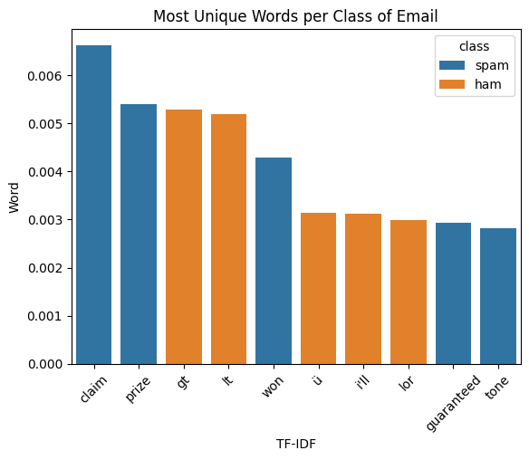

**Term-Frequency Inverse Document Frequency (TF-IDF)**
------------------------------------------------------

----------------------------------------------------------------------------------------------------------------------------------------

TF-IDF (Term Frequency–Inverse Document Frequency) is a method used to analyze multiple texts by assigning importance to words based on how often they appear in a document relative to how common they are across all documents. This improves on relative frequency, which is mainly useful for comparing only two texts.TF-IDF is defined as:

												𝑇𝐹⋅𝐼𝐷𝐹 = 𝑇𝐹ln(1𝐷𝐹) = −𝑇𝐹ln(𝐷𝐹) 

Where TF is text frequency:

			𝑇𝐹= Text Frequency =# of times 𝑤𝑜𝑟𝑑 appears in a document/total words in the document 

DF is Document Frequency:

				𝐷𝐹= Document Frequency =# of documents 𝑤𝑜𝑟𝑑 appears in/# of documents 

TF-IDF improves upon basic word counting and relative frequency by measuring how unique a word is to a particular document. While word counts and relative frequency simply track how often a word appears, TF-IDF lowers the importance of words that appear in nearly all documents and increases the importance of words that are specific to fewer documents.

TF-IDF can also be used to help create machine learning models like Support Vector Machines and Logistic Regressions as it turns words is specific numerical values (or vectors). This will explored later.

Now that our data is loaded, we can use our TF-IDF function to find the most unique word to each class, which is spam or ham. We will use bax.tf_idf and is best used with pipe() operator. We will also utilize our stopewords function denoted by bax.stopwords as it removes words not important to our analysis. However, this is not super important for TF-IDF as it drives many stopwords to a zero value naturally.

-----------------------------------------------------------------------------------------------------------------

**TF-IDF In Action**

.. code-block :: python

	spam_tfidf = (
    		spam
    		.pipe(bax.tokenize, 'text') # tokenizes text
    		.pipe(bax.stopwords, 'word') # removes stopwords
    		.groupby('class')['word']
    		.value_counts(normalize=True) # text frequency
    		.reset_index()
    		.pipe(bax.tf_idf, col='class') # tf-idf calculation
	)
	x = spam_tfidf.sort_values(by = 'tf_idf', ascending= False)
	x = x.loc[x.tf_idf != 0] # many words will have tf_idf = 0 but those words aren't 		important, so we can filter them out for cleaner results
	x

.. code-block :: python
	
	graph = x[0:10]
	sns.barplot(graph, x = "word", y = 'tf_idf', hue = "class" , legend= True)
	plt.title('Most Unique Words per Class of Email')
	plt.xlabel('TF-IDF')
	plt.ylabel('Word')
	plt.xticks(rotation = 45)
	plt.show()

**Output** 

----------------------------------------------------------------------------------------------------------------------------------------

Here we can see which words are the most unique to the spam and ham classes. Now we can finally see which words are truy most associated with each class of email. There is some of the same words from relative frequencies and word counting and there is some new ones. Which one you choose depends on the context of the situation. In situations where there are more than two documents, you need to use TF-IDF instead of relative frequencies. When there is only two documents, relative frequencies is still a great method, and it is a bit more interpretable as well. In the case of Machine Learning, TF-IDF is definitely the better measure to proceed with. Overall, they are both great methods for textual anlysis depending on the context, and most importantly is all possible due to tokenization.

----------------------------------------------------------------------------------------------------------------------------------------

